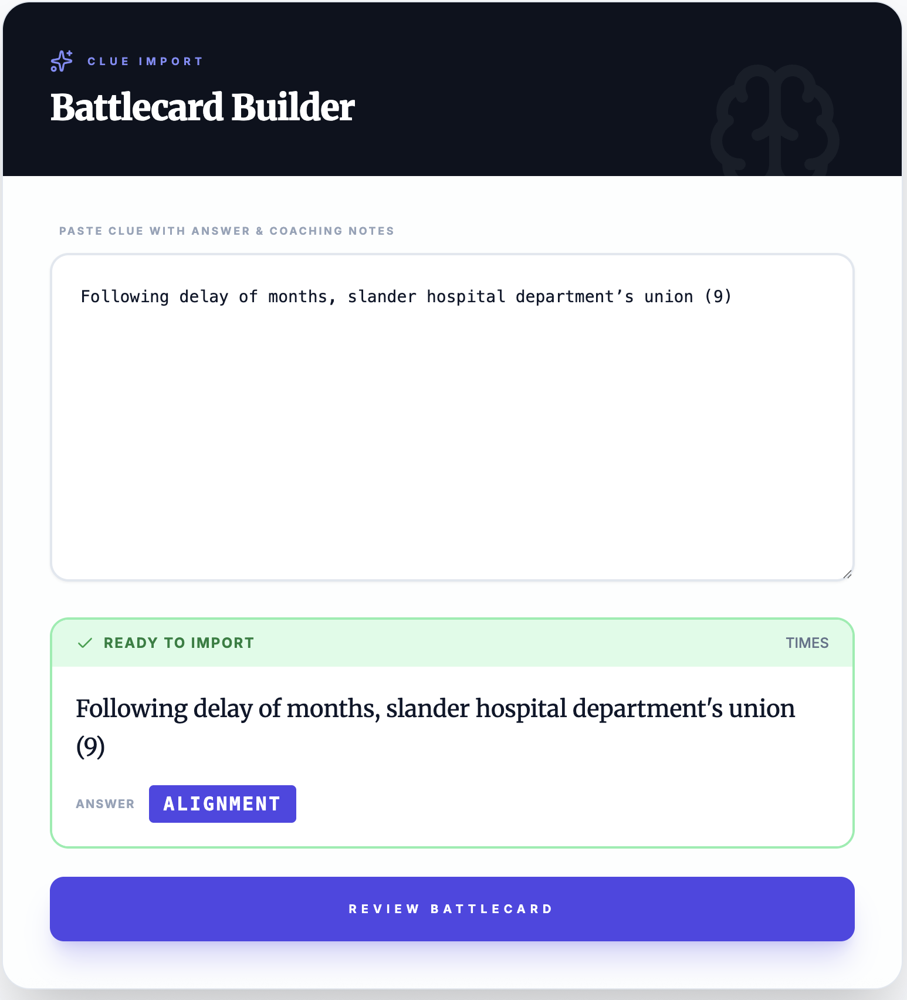
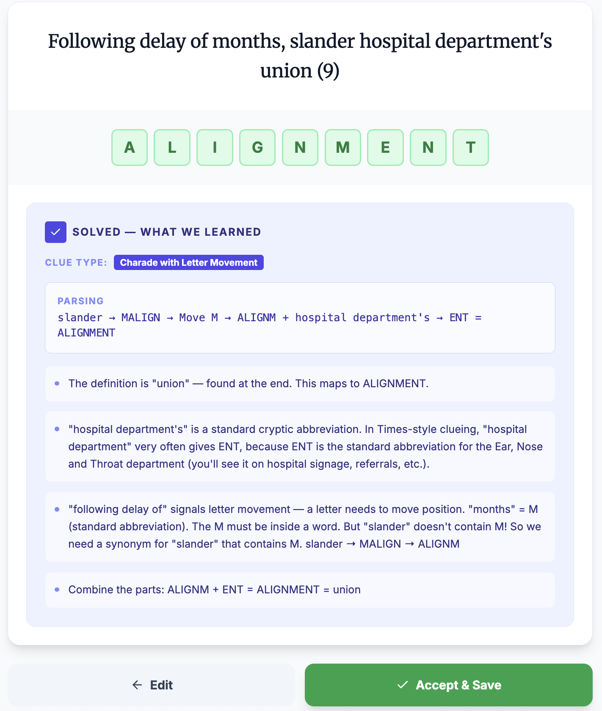

# Interactive Solve Flow — Times Cryptic Crossword

## Clue
Orderly snubbed close to end of shift (4)

---

## What the user always sees on screen

- The clue
- An answer entry field (crossword-style boxes):
  ⬜ ⬜ ⬜ ⬜
- A hint describing what to do next
- An action area (click / select / type)
- A "Got it" button to reveal the logic chain
- A list of what has been discovered so far

### Color System

Correct selections are shaded:
- Definition → **green**
- Wordplay indicator → **orange**
- Wordplay fodder → **blue**

Partial selections (on the right track but incomplete):
- Lighter shade of target color + "Keep selecting..." prompt

The answer is never revealed by the system.

---

## Step 1 — Identify the Definition

### Hint
The definition is usually at the start or the end of the clue. Sometimes the whole clue is the definition, or there may be two.

### Action
Click the word or words you think form the definition.

### Interaction
- Partial match: selection turns **light green** with "Keep selecting..." prompt
- Correct match: selection turns **green** and auto-advances to next step

### Got it
Reveals: Definition position (START/END) and tips for finding definitions.

### What we've discovered so far
- Definition (green)

---

## Step 2 — Wordplay 1: Identify the Indicator

### Hint
The Times uses a limited set of common signals for wordplay.
Read the clue and try to spot the most obvious one.

### Action
Click the wordplay indicator.

### Interaction
- Partial match: selection turns **light orange** with "Keep selecting..." prompt
- Correct match: selection turns **orange** and auto-advances to fodder step

### Got it
Reveals: Logic chain showing indicator → operation type.

### What we've discovered so far
- Definition (green)
- Wordplay indicator (orange)

---

## Step 2b — Wordplay 1: Identify the Fodder

### Hint
Now that we've found the indicator, decide what word or words the instruction applies to.
In Times clues, this is usually right next to the indicator.

### Action
Click the fodder.

### Interaction
- Partial match: selection turns **light blue** with "Keep selecting..." prompt
- Correct match: selection turns **blue** and auto-advances to decode step

### Got it
Reveals: Logic chain showing fodder → synonym (if applicable) → result.

### What we've discovered so far
- Definition (green)
- Indicator (orange)
- Fodder (blue)

---

## Step 2c — Wordplay 1: Fodder Decode

### Hint
Look at the fodder and consider the instruction.
If applying it directly doesn't fit the answer length, don't force it.

This usually means you need to find a **simple synonym** that *does* fit,
then apply the instruction to that.

If you think you've found some letters, you can try entering them into the answer boxes.
If not, move on and look for the next wordplay.

### Action
- Enter letters into the answer grid, or
- Click Continue to move to the next wordplay

### Got it
Reveals: Full logic chain for this wordplay component.

---

## Step 3 — Wordplay 2: Identify the Indicator

### Hint
Scan the clue again.
Can you spot the next wordplay indicator?

### Action
Click the next indicator.

### Interaction
- Partial match: selection turns **light orange** with "Keep selecting..." prompt
- Correct match: selection turns **orange** and auto-advances

### What we've discovered so far
- Definition (green)
- Wordplay 1 indicator and fodder
- Wordplay 2 indicator (orange)

---

## Step 3b — Wordplay 2: Identify the Fodder

### Hint
Having found the indicator, decide what word it applies to.

### Action
Click the fodder.

### Interaction
- Partial match: selection turns **light blue** with "Keep selecting..." prompt
- Correct match: selection turns **blue** and auto-advances

### What we've discovered so far
- Definition (green)
- Wordplay 1 components
- Wordplay 2 indicator (orange)
- Wordplay 2 fodder (blue)

---

## Step 3c — Wordplay 2: Fodder Decode

### Hint
Apply the instruction to the fodder and see what letter or letters you get.
Enter those letters into the answer grid.

If you still can't solve the clue, review what you've discovered so far.

### Action
Enter letters and click Continue.

---

## Step 4 — Solve

### Hint
You now have all the information needed to solve this clue.
Use the definition to check that your answer makes sense.

### Action
Enter your final answer.

---

## Solved — What to Remember Next Time

*(This replaces the "What we've discovered so far" panel once the user solves the clue.)*

- **Times setters often place the definition at the beginning or the end of the clue.**
  *Example:* "Orderly" appears at the start.

- **Times setters often use words like "snubbed" to signal letter removal.**
  *Example:* "snubbed" tells us a letter must be dropped.

- **If the letters don't fit, Times setters often expect you to resolve the fodder first.**
  *Example:* "close to" needs to be replaced by a simple synonym before removing a letter.

- **Phrases like "end of" commonly mean take the last letter.**
  *Example:* "end of shift" supplies the final letter.

These patterns repeat frequently in Times cryptic crosswords.

---

## UI Behavior Summary

| Action | Result |
|--------|--------|
| Click word(s) - partial match | Light color + "Keep selecting..." |
| Click word(s) - correct match | Full color + auto-advance to next step |
| Click "Got it" | Reveals logic chain explanation |
| Click "Skip" | Skips current step (auto-fills discovery) |
| Click "Reveal Answer" | Shows answer and marks as complete |
| Fill answer grid correctly | Auto-checks and completes |

---

## UI Reference Screenshots

### Battlecard Builder — Input View

The import screen where raw clue data is pasted. Shows:
- Text input area for pasting clue data
- "READY TO IMPORT" status indicator
- "REVIEW BATTLECARD" button to proceed

### Battlecard Builder — Solved View

The review screen after parser processing. Shows:
- Answer grid with letter boxes
- Definition and wordplay step explanations
- "Edit" button to modify parsing
- "Accept" button to save to collection
